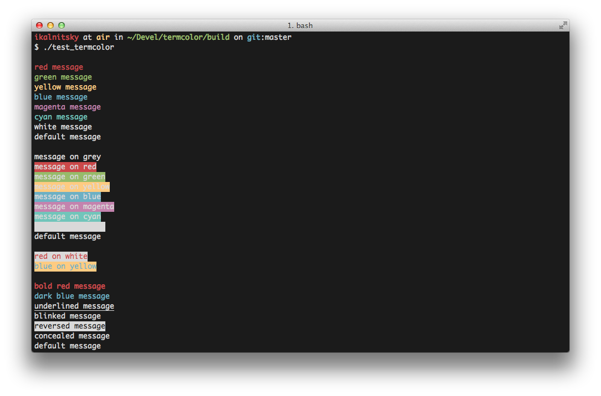

Termcolor
=========

.. -*- inclusion-marker-for-sphinx-docs -*-

Termcolor_ is a header-only C++ library for printing colored messages to the
terminal. Written just for fun with a help of `the Force`_. Termcolor uses
`ANSI color formatting`_, so you can use it on every system that is used such
terminals (most \*nix systems, including Linux and Mac OS). On Windows, WinAPI
is used instead but some limitations are applied.

It's licensed under the BSD (3-clause) License. That basically means:
do whatever you want as long as copyright sticks around.

.. _Termcolor: https://github.com/ikalnitsky/termcolor
.. _the Force: http://starwars.wikia.com/wiki/The_Force
.. _ANSI color formatting: http://en.wikipedia.org/wiki/ANSI_escape_code#Colors

Installation
------------

Add ``termcolor.hpp`` to the project and use provided stream manipulators
from the ``termcolor`` namespace.

Vcpkg Integration
------------

Alternatively, if you are using the vcpkg_ dependency manager you can download and install termcolor with CMake integration in a single command:

.. _vcpkg: https://github.com/microsoft/vcpkg

.. code:: sh

   vcpkg install termcolor

How to use?
-----------

It's very easy to use. The idea is based on the use of C++ stream
manipulators. The typical «Hello World» application is below:

.. code:: c++

    #include <iostream>
    #include <termcolor/termcolor.hpp>

    int main(int /*argc*/, char** /*argv*/)
    {
        std::cout << termcolor::red << "Hello, ";
        std::cout << termcolor::color<100> << "Colorful ";
        std::cout << termcolor::color<211, 54, 130> << "World!";
        std::cout << std::endl;
        return 0;
    }

The application above prints a string with red. It's obvious, isn't it?
There is a one problem that is not obvious for the unexperienced users.
If you write something this way:

.. code:: c++

    std::cout << termcolor::red << "Hello, Colorful World!" << std::endl;
    std::cout << "Here I'm!" << std::endl;

the phrase «Here I'm» will be printed with red too. Why? Because you don't
reset termcolor's setting. So if you want to print text wit default terminal
setting you have to reset termcolor's settings. It can be done by using
``termcolor::reset`` manipulator:

.. code:: c++

    std::cout << termcolor::red << "Hello, Colorful World!" << std::endl;
    std::cout << termcolor::reset << "Here I'm!" << std::endl;

By default, Termcolor ignores any colors for non-tty streams
(e.g. ``std::stringstream``), so:

.. code:: c++

    std::stringstream ss;
    ss << termcolor::red << "unicorn";
    std::cout << ss.str();

would print «unicorn» using default color, not red. In order to change this
behaviour one can use ``termcolor::colorize`` manipulator that enforce colors
no matter what.

What manipulators are supported?
--------------------------------

The manipulators are divided into four groups:

* *foreground*, which changes text color;
* *background*, which changes text background color;
* *attributes*, which changes some text style (bold, underline, etc);
* *control*, which changes termcolor's behaviour.

Foreground manipulators
.......................

#. ``termcolor::grey``
#. ``termcolor::red``
#. ``termcolor::green``
#. ``termcolor::yellow``
#. ``termcolor::blue``
#. ``termcolor::magenta``
#. ``termcolor::cyan``
#. ``termcolor::white``
#. ``termcolor::color<256_COLOR_CODE>``
#. ``termcolor::color<RED, GREEN, BLUE>``

Background manipulators
.......................

#. ``termcolor::on_grey``
#. ``termcolor::on_red``
#. ``termcolor::on_green``
#. ``termcolor::on_yellow``
#. ``termcolor::on_blue``
#. ``termcolor::on_magenta``
#. ``termcolor::on_cyan``
#. ``termcolor::on_white``
#. ``termcolor::on_color<256_COLOR_CODE>``
#. ``termcolor::on_color<RED, GREEN, BLUE>``

Attribute manipulators
......................

(so far they aren't supported on Windows)

#. ``termcolor::bold``
#. ``termcolor::dark``
#. ``termcolor::italic``
#. ``termcolor::underline``
#. ``termcolor::blink``
#. ``termcolor::reverse``
#. ``termcolor::concealed``
#. ``termcolor::crossed``

Control manipulators
....................

(so far they aren't supported on Windows)

#. ``termcolor::colorize``
#. ``termcolor::nocolorize``
